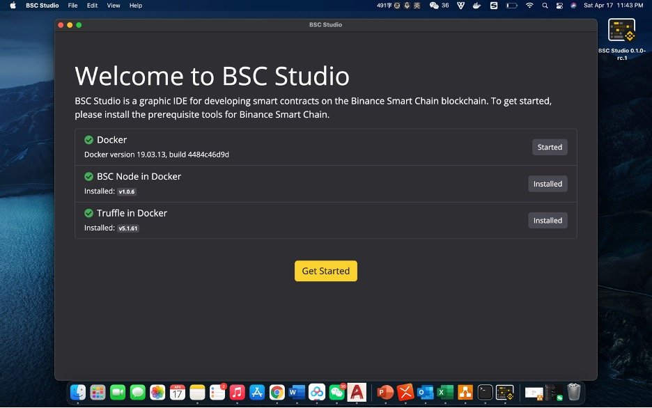
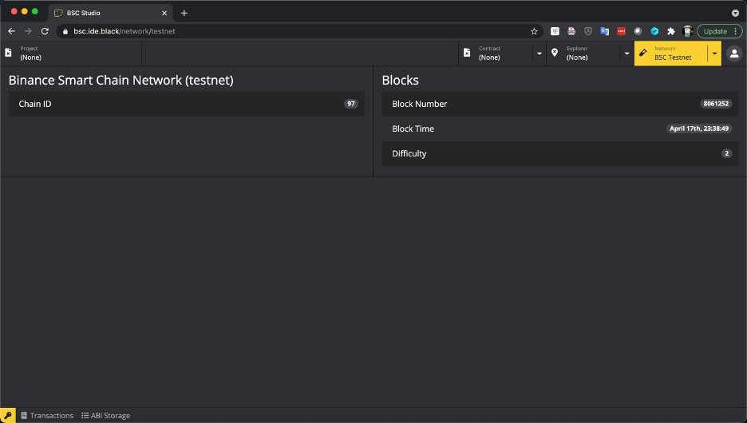
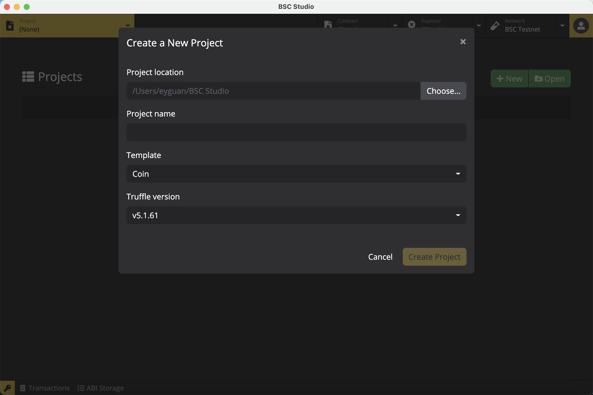

# BNB Development Quick Reference Guide

English | [简体中文](https://github.com/ObsidianLabs/bsc-dapp-tutorial#readme)

## Catalog
- [About BNB Chain](#About-Binance-Smart-Chain)
- [Get Your BNB Wallet Ready](#Get-Your-BNB-Wallet-Ready)
    + [Using Browser Plugin Wallet](#Browser-Plugin-Wallet)
    + [Using Wallet App](#Wallet-App)
- [Preparing BNB Development Environment](#Preparing-BNB-Development-Environment)
    + [Develop locally with BNB Studio Desktop](#Develop-locally-with-BNB-Studio-Desktop)
    + [Develop online with BNB Studio Web](#Develop-online-with-BNB-Studio-Web)
- [Connecting to BNB networks](#Connecting-to-BNB-networks)
- [BNB Smart Contract Development](#BNB-Smart-Contract-Development)   
    + [Key Tools in BNB Development](#Key-Tools-in-BNB-Development)
    + [Creating Smart Contract Project](#Creating-Smart-Contract-Project)
    + [Contract Deployment and Interaction](#Contract-Deployment-and-Interaction)
- [Developing a complete dApp](#Developing-a-complete-dApp)

## About BNB Chain
BNB Chain is a sovereign smart contract blockchain delivering Ethereum Virtual Machine (EVM) compatible programmability and that are composed of Binance Chain and Binance Smart Chain (BSC) . By introducing the Proof of Stake Authority (PoSA) consensus mechanism, BNB has created an ecosystem that allows nodes, token holders, developers, and users to benefit from the blockchain. 

This article is a quick start guide for BNB developers, hoping to provide developers with help.

## Get Your BNB Wallet Ready
In the blockchain world, digital wallet is not the actual container for cryptocurrencies. Rather, it stores pairs of encryption keys that represents ownership at certain address. Each pair of keys stored in digital wallets consists of a public key that is needed to initiate transactions and a matching private key for transaction encryptions and decryptions. Therefore, ownership of keypairs confers full control of the cryptocurrencies at the address associated to the keypairs. In development stage, we create randomized keypairs and a piece of address information through our digital wallet, with which we are able to receive from or send to cryptocurrencies to others. And this is why we have to get our wallet ready for development. 

We highly recommend to use **Browser Plugin Wallet** or **Wallet App** to manage keypairs while developing on BNB Chain.

### Browser Plugin Wallet
Browser plugin wallet is the most popular choice in blockchain development. It's easy to set up, install and access the wallet in the browser. Besides that, since majority of blockchain applications are web-based, browser plugin wallet gives an intuitive access to pretty much all DeFi and NFT apps available on the market.

|  |  Wallet  |  Address  |  Tutorial  |
|:---:|:---:|---|---|
|  1  |  MetaMask  |  https://metamask.io/  | https://docs.binance.org/smart-chain/wallet/metamask.html  |
|  2  |  Binance Chain Wallet | https://chrome.google.com/webstore/detail/binance-chain-wallet/fhbohimaelbohpjbbldcngcnapndodjp?hl=en  | https://binance-wallet.gitbook.io/binance-chain-extension-wallet/

*Please note*，**Binance Chain Wallet**  supports both **Binance Chain** and **BNB Chain** and they're two distinctive blockchains that sometimes confuses people.

### Wallet App 
When a smart contract goes live, most of its users access it through a wallet app of their choice.

|   |	Wallet |	Address | Tutorial (Chinese only) |
|:---:|:---:|---|---|
| 1 |	TrustWallet |	https://trustwallet.com/  | https://www.binancezh.cc/zh-CN/blog/421499824684901157  |
| 2	| MathWallet |	https://www.mathwallet.org/en-us/ | https://blog.mathwallet.xyz/?p=3895  |
| 3 |	TokenPocket	| https://www.tokenpocket.pro/en/ | https://mp.weixin.qq.com/s/xXjP_qAOF31f-mGauXl7Kw |

## Preparing BNB Development Environment
### Start Development today with BNB Studio
BNB Studio is a powerful yet user-friendly graphic IDE platform, specially designed for BNB. It supports running locally on majority OS, including macOS, Windows and Linux and also on web browsers. Comparing with traditional Ethereum development toolkit like Remix and Ganache, BNB Studio streamlines environment preparation procedure and integrates essential tools for a complete development lifecycle, including a graphic code editor, project manager, keypair manager, block explorer, contract inspector and network manager. 

### Develop locally with BNB Studio Desktop
BNB Studio Desktop is a great all-in-one IDE platform for BNB developers at all levels. You may download the latest release of BNB Studio Desktop at its [Github Repo](https://github.com/ObsidianLabs/BSC-Studio) . BNB Studio currently supports major OS including macOS, Linux and Windows.

#### Installation
* macOS: Double click to open *BNB-Studio-x.x.x.dmg* and drag the app into Application folder.
* Linux: Double click to open *BNB-Studio-x.x.x.AppImage*, Select *Properties => Permissions => Execute* and tick *Allow executing file as program* option. Close Properties window and double click to open the application.**Please note, different Linux distribution might have different application installation procedure.**
* Windows: Double click to open *BNB-Studio-x.x.x.exe*

#### Preparing Prerequisites 
Upon first successful startup of BNB Studio, you'll be directed to a welcome screen where shows a list of prerequisites for BNB Development, including Docker, BNB Node and Truffle.
* BNB Studio relies on [Docker](https://www.docker.com/) to start BNB node and compile projects. If you haven't had Docker on your machines yet, click on *Install Docker* to visit official Docker website to download latest release and install.
* [BNB Docker Hub](https://hub.docker.com/repository/docker/obsidians/bsc) stores Docker images for BNB nodes, which BNB Studio relies on to run BNB node.
* [BNB Truffle](https://hub.docker.com/repository/docker/obsidians/truffle) is the truffle toolkit used by BNB Studio for project creation and compilation.

When all prerequisites are successfully installed and started on local machine, a green *Get Started* button will replace the gray *Skip* button. Now go ahead and click to start your smart contract development!

  

### Develop online with BNB Studio Web
BNB Studio also offers a web version for developers who wish to develop, compile and run BNB smart contracts online. BNB Studio web inherits most functionalities of the Desktop version but no longer require setting up dependencies on local machines. It's the perfect choice for BNB developers who wants to try out BNB development without worrying about setting up BNB dependencies locally. Visit [bsc.ide.black](http://bsc.ide.black/) to experience BNB development on the cloud.

  

For more information and tutorials on BNB Studio, check out BNB Studio [Github Page](https://github.com/ObsidianLabs/BSC-Studio)

## Connecting to BNB networks
BNB primarily offers two networks, namely BNB Mainnet and BNB Testnet.
* BNB Testnet, is a test network for test purposes, where Testnet tokens can be *faucet* free of charge and therefore contains no monetary value. 
* BNB Mainnet, is the main network for production applications. Users are interacting with smart contracts on the Mainnet and thus Mainnet tokens (BNB/BEP20) are actual cryptocurrencies. 

BNB Studio has BNB Mainnet and Testnet connection preconfigured in the application and you may easily switch between these two networks. In order to support smoother development on BNB networks, BNB Studio comes with a set of built-in tools like Browser Wallet, Block Explorer, Faucet Tool, covering the most popular tools among BNB developers.

### BNB Block Explorer
BNB offers block explorer apps for network and on-chain information inquiry, Click to access [Testnet Explorer - testnet.bscscan.com](https://testnet.bscscan.com/) or [Mainnet Explorer - bscscan.com](https://bscscan.com/).

### BNB Data Solution
If you're no longer satisfied with the chain's speed in sync as a result of scalability limited by native nodes, StreamingFast offers an alternative streaming solution with full history for those who wants to get real-time updates of contracts, account balances, AMM prices or sync their local database, with speed 50x faster than nodes. Available to everyone for free at [StreamingFast.io](https://streamingfast.io)

### Faucet
Developers often needs tokens when developing on BNB Testnet to play with contract or to make transactions. BNB Testnet offers [Faucet](https://testnet.binance.org/faucet-smart) service to acquire free Testnet tokens, of course BNB Studio also integrates [Faucet Functionality](https://github.com/ObsidianLabs/BSC-Studio#faucet) in the toolbar for easier invocation to faucet tokens.

## BNB Smart Contract Development

### Key Tools in BNB Development

[Truffle](https://www.trufflesuite.com/truffle)
Truffle is a development framework based on Solidity that aim to simplifies construction and management process of dApp. Truffle is written in Javascript comes with a powerful set of features to support compilation, deployment and test of smart contracts. 

[Solc](https://github.com/ethereum/solidity)
Solc is command line compiler for Solidity. It compiles smart contract code written in Solidity into binary code in EVM and eventually deploy to act just like other smart contracts we have seen on chain.

[BNB Client (base on Geth)](https://github.com/binance-chain/bsc)
Based on Ethereum Yellow Paper, anyone are allowed to construct their Ethereum node with a programming language of their choice, however the most popular clients so far go to **Geth** and **Parity**. The difference is mainly the language, where Geth is written in Golang while Parity is made of Rust. Between these two, Geth is more popular and thus is the client implementation we use here.
BNB Client is a BNB client application based on Geth, where both our BNB nodes (Testnet/Mainnet) are running on it. We can also run our own BNB nodes and local development network with self-installed BNB client of our choice.

**BNB Studio** has integrated all essentials development tools including Truffle, Solc and BNB Client.

### Creating Smart Contract Project
BNB Studio integrates a few smart contract template. You may create your first smart contract project with a corresponding template and start building your smart contract instantly. Built-in templates include:
* Coin: A basic token-based smart contract
* [Open Zeppelin](https://openzeppelin.com/): A smart contract offers ERC-20, ETC-721(NFT) tokens, based on Open Zeppelin.
* [MetaCoin](https://github.com/truffle-box/metacoin-box):A MetaCoin template based on Truffle.

  

### Contract Deployment and Interaction

BNB Studio offers one-click automated process to
1. [Contract Deployment](https://github.com/ObsidianLabs/BSC-Studio#Deploy-Smart-Contract-Project)
2. [Contract Interaction](https://github.com/ObsidianLabs/BSC-Studio#Call-the-Contract)

Click to view corresponding tutorials on our Github.

## Developing a complete dApp

The smart contract we just written is a services running on BNB Chain, it defines a series of on-chain transaction serving the purpose we have set in development. It functions like the backend service in the traditional software practice, so in order to take off the burden of programming, we also need to develop a frontend application to serve as the user interface to the smart contract so that the combination makes a simple, but complete blockchain application, also known as decentralized application or dApp.

A successful Dapp project requires all of the following steps:
* Integrate front-end SDK: A Ethereum-supported SDK like **web3.js** or **ethers.js**
* Configure SDK with BNB-RPC interface: Documentation can be found at [BNB-RPC](https://docs.binance.org/smart-chain/developer/rpc.html)
* Integrate Browser Plugin SDK: such as MetaMask or Binance Chain Wallet
* *Optional* Integrate [BSC Scan APIs](https://bscscan.com/apis) to allow inquiry on-chain data that are not supported by RPC interface (i.e. transaction history, token information)

Here's a complete [BNB dApp Example](https://github.com/ObsidianLabs/bsc-dapp-example) for your reference.

In this example:
* Application auto-detect Browser Plugin Wallet, including **MetaMask** or **Binance Chain Wallet**;
* This dApp auto-detect current network (BNB Testnet/Mainnet);
* If all tests passed, A pop-up windows will show up to request authorization for access;
* This dApp offers **transfer** button. Input required information and press **Execute** button, dApp will invoke pop-up windows through browser plugin where users can sign the transaction to complete it;
* This dApp provides methods to interact with contract.

